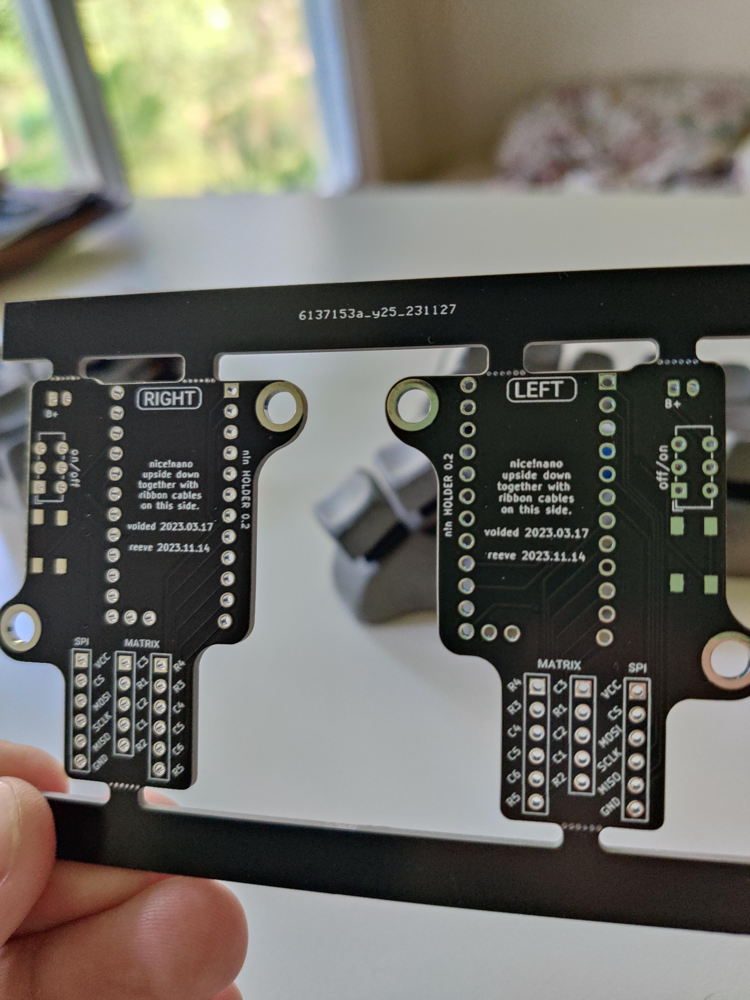

## Holder PCB for nice!nano

### nice!nano v2 holder PCB for Bastard Keyboards Charybdis
### WARNING: The PCBs have been printed and tested, however not an Electrical Engineer use at your own risk and go over the files before ordering any prototypes.

### Features:
- matrix pinout moved to low frequency pins
- spi trackball connection moved to high frequency pins
- removed rgb and serial connection
- repositioned reset footprint
- replaced and repositioned on/off
- ph2 battery connector

## BOM

Power Switch: https://au.mouser.com/ProductDetail/CK/JS202011CQN?qs=LgMIjt8LuD%2Fe%2BE3iTcEFYw%3D%3D&countryCode=AU&currencyCode=AUD

Reset Button: Button, 4x4x1.5 https://www.aliexpress.com/item/1005001304569553.html?spm=a2g0s.9042311.0.0.27424c4dDwgcp7

Ultra Low Profile Sockets: 315-43-164-41-003000
Other sockets will not be low enough to fit USBC cutout.

# License 

This work is licensed under a Creative Commons Attribution-NonCommercial-ShareAlike 4.0 International License.
